<h2>Punto 1: constantes y variables</h2>
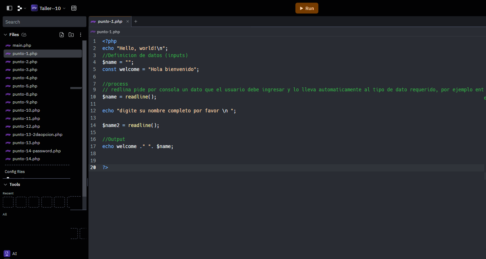

<h2>Punto 2: suma de constastes y variables  </h2>
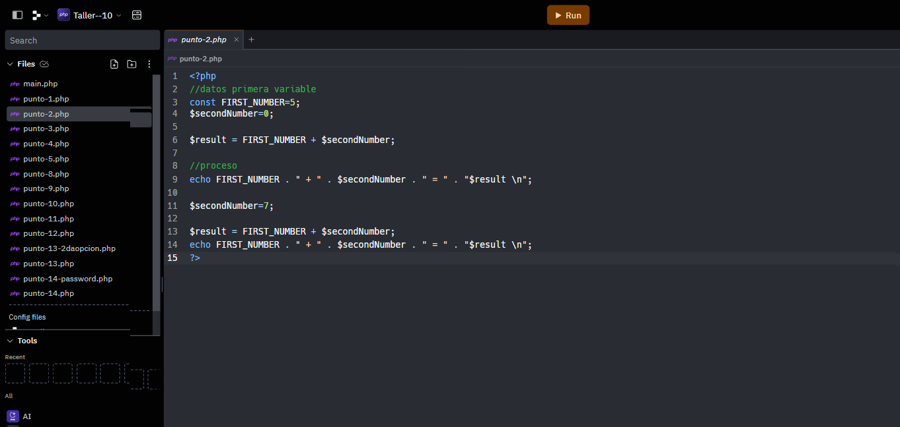
<h2>Punto 3: suma de dos numeros indicados por el usuario</h2>
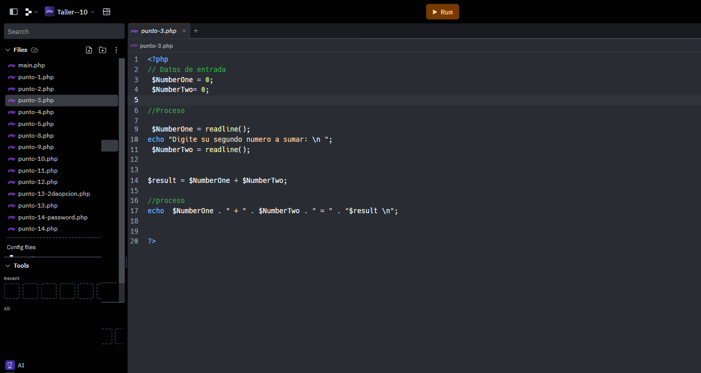
<h2>Punto 4: Datos del usuario por consola</h2>
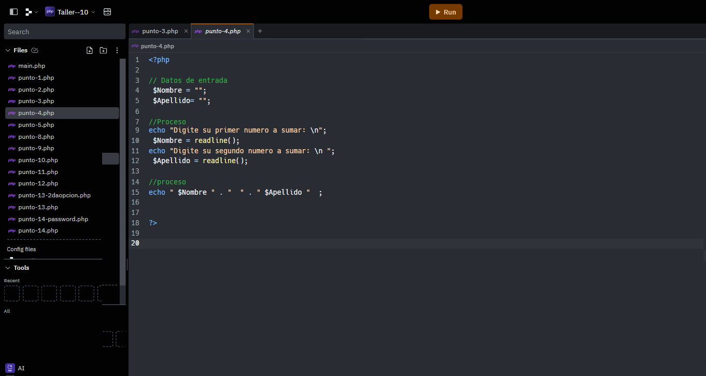
<h2>Punto 5: Entrada de bolera usando if/else</h2>
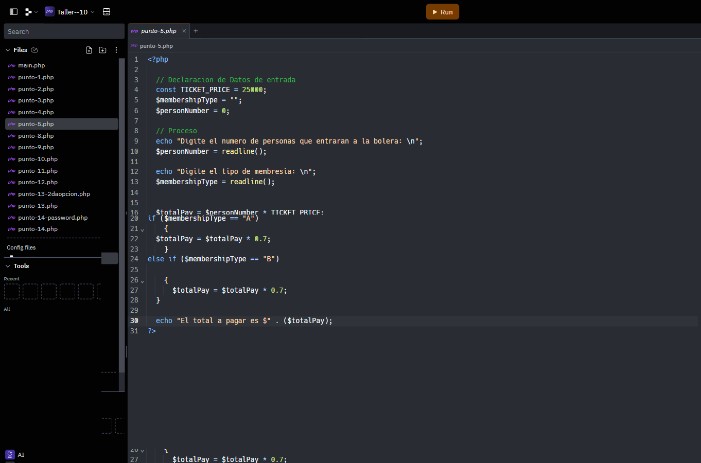
<h2>Punto 6: Detección de mayoria de edad</h2>

<h2>Punto 7: Entrada de bolera usando if/else</h2>

<h2>Punto 8: Entrada de bolera usando switch</h2>
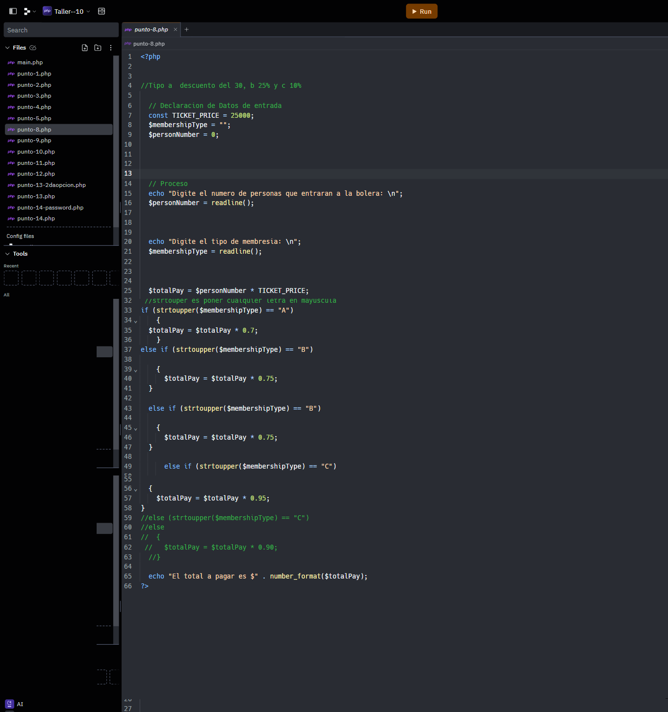
<h2>Punto 9: Tabla de multiplicar usando while</h2>
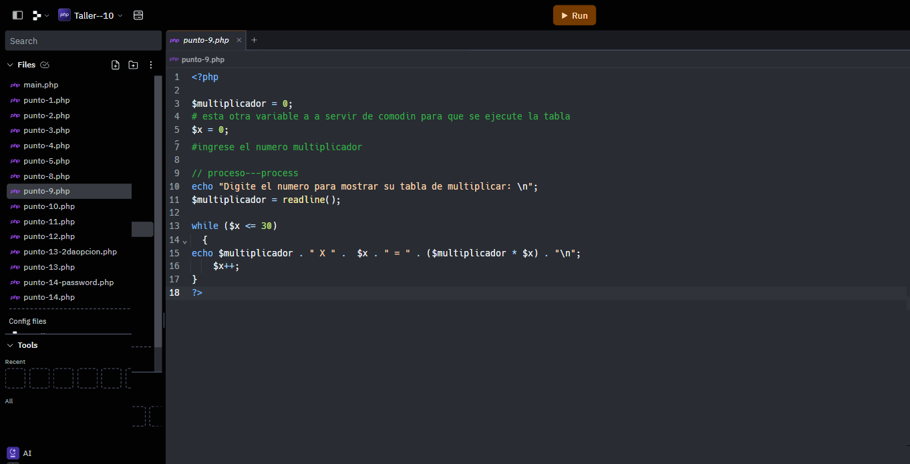
<h2>Punto 10: Numeros pares usando while</h2>
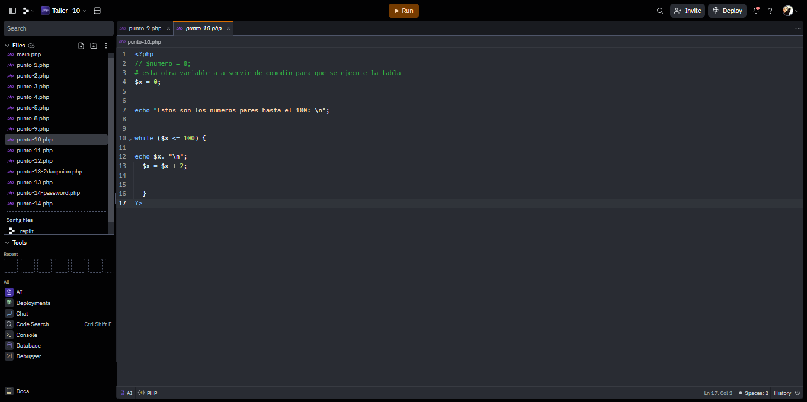
<h2>Punto 11: Numeros impares usando for</h2>
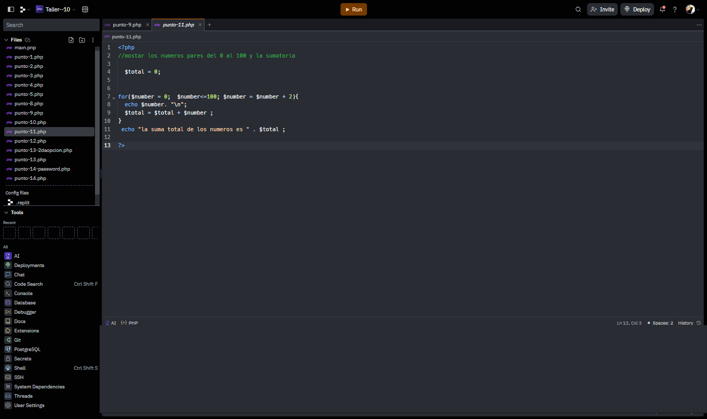
<h2>Punto 12: Tabla de multiplicar usando for</h2>
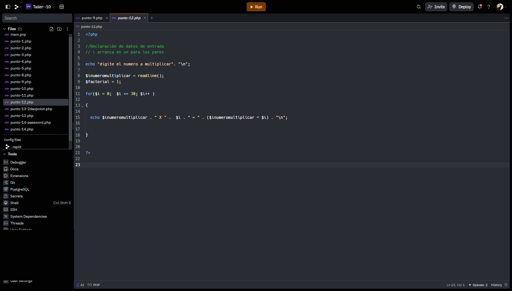
<h2>Punto 13: Suma de valores de un arreglo usando foreach</h2>
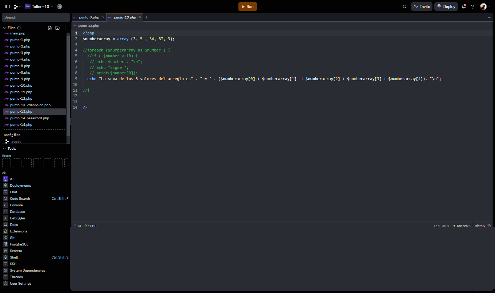
<h2>Punto 14: Revisión de contraseña</h2>

<h2>Punto 15: Seleccion de operaciónb aritmetica</h2>

